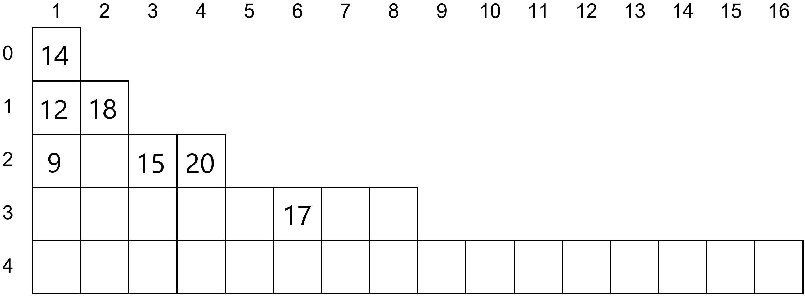

# Rozwiązania

## Zadanie 1

### 1.1



### 1.2

| $n$ - liczba książek | Minimalna liczba półek | Maksymalna liczba półek |
|-|-|-|
| 1 | 1 | 1 |
| 3 | 2 | 3 | 
| 4 | 3 | 4 |
| 7 | **3**  | **7** |
| 16 | 5 | **16** |
| 31 | **5** | **31** |
| 32 | **6** | **32** |
| $2^k - 1$, dla $k>0$ | $k$ | $2^k - 1$ |

### 1.3

a) $9, 2, 12, 10, 14, 13, 15$ 

b) $10, 8, 4, 6, 15, 12, 13$

## Zadanie 2

### 2.1

```
1. b := 1
2. ostatnia := n mod 2
3. n := n div 2
4. Dopóki n > 0, wykonuj:
    5. Jeżeli n mod 2 != ostatnia:
        6. b := b + 1
        7. ostatnia := n mod 2
    8. n := n div 2
9. Wypisz b
```

### 2.2

=== "Python"

  ```python linenums="1"
  with open("bin.txt") as input_file:
    binary_list = input_file.read().split()

  result = 0

  for bn in binary_list:
    if bn.count("01") + bn.count("10") <= 1:
      result += 1

  print(result)
  ```

### 2.3

=== "Python"

  ```python linenums="1"
  with open("bin.txt") as input_file:
    binary_list = input_file.read().split()

  binary_list.sort(key=lambda el: int(el, 2))

  print(binary_list[-1])
  ```

### 2.4

$(123_{10} \oplus 101101_2) \oplus 2D_{16} = 123_{10}$

### 2.5

=== "Python"

  ```python linenums="1"
  with open("bin.txt") as input_file:
    binary_list = input_file.read().split()

  for bn in binary_list:
    result = str(bin(int(bn, 2) ^ (int(bn, 2) // 2))).lstrip("0b")
    print(result)
  ```

## Zadanie 3

### 3.1

TODO

### 3.2

TODO

### 3.3

TODO

### 3.4

TODO

## Zadanie 4

1. **P**
2. **F**

## Zadanie 5

$134_5 < 134_6$

$2222_3 < 1111_6$

## Zadanie 6

[:material-microsoft-excel: Rozwiązanie - Excel](../../../assets/zad6_2023.xlsx)

### 6.1

[https://jmp.sh/whDEfpik](https://jmp.sh/whDEfpik)

### 6.2

[https://jmp.sh/A9EuPPp3](https://jmp.sh/A9EuPPp3)

### 6.3 i 6.4

[https://jmp.sh/JfzN7REr](https://jmp.sh/JfzN7REr)

## Zadanie 7

[:material-microsoft-access: Rozwiązanie - Access](../../../assets/zad7_2023.accdb)

### 7.1

[https://jmp.sh/AcK5dXDf](https://jmp.sh/AcK5dXDf)

### 7.2

[https://jmp.sh/YLtAaFsp](https://jmp.sh/YLtAaFsp)

### 7.3

[https://jmp.sh/1VcfOKEW](https://jmp.sh/1VcfOKEW)

### 7.4

[https://jmp.sh/tHCeL5oN](https://jmp.sh/tHCeL5oN)

### 7.5

```SQL
SELECT SUM(cena) 
  FROM Sklep 
    LEFT JOIN Gry USING(id_gry) 
  WHERE kategoria="logiczna" AND promocja=true;
```
