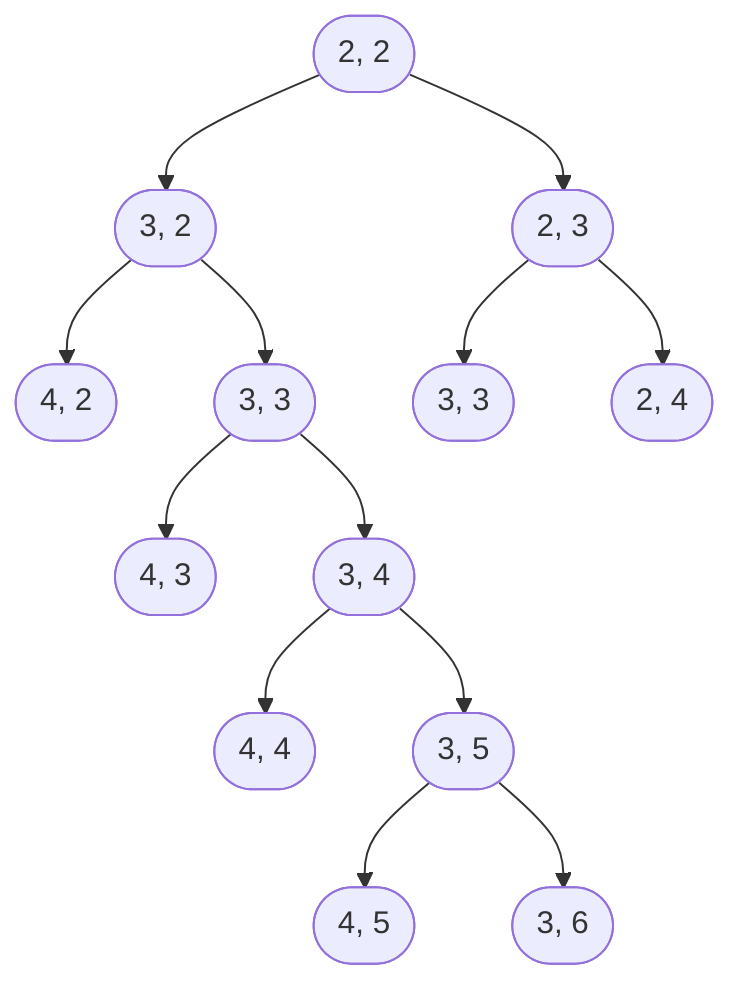
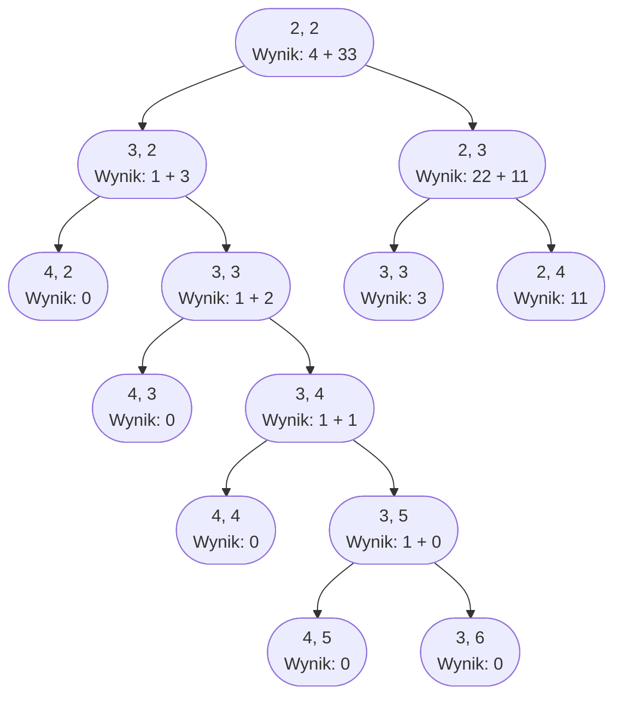

# Rozwiązania

## Zadanie 2

### 2.3

```
Funkcja czy_k_rosnaca(A, n, k):
	1. Od i := 1 do n - k, wykonuj:
		2. Jeżeli A[i] >= A[i + k], to:
			3. Zwróć FAŁSZ
	4. Zwróć PRAWDA
```

Zaczynamy od pętli, która przechodzi przez kolejne indeksy w tablicy $$A$$ od $$1$$ do $$n - k$$ włącznie.
Chcemy zatrzymać się $$k$$ elementów przed końcem tablicy, ponieważ będziemy porównywać w pętli element obecny ($$A[i]$$) z elementem oddalonym od niego o $$k$$ ($$A[i + k]$$).
Dlatego musimy zadbać o to, aby nie wyjść poza zakres tablicy.

Wewnątrz pętli porównujemy ze sobą elementy w taki sposób, by sprawdzić, czy tablica **nie** jest $$k$$-rosnąca. Dlatego sprawdzamy czy obecny element ($$A[i]$$) jest większy lub równy od elementu oddalonego od niego o $$k$$ ($$A[i + k]$$). Jeżeli tak jest, to znaczy że tablica nie jest $$k$$-rosnąca, więc zwracamy wartość FAŁSZ jednocześnie kończąc działanie funkcji.

Jeżeli przejdziemy przez całą tablicę i nie znajdziemy dwóch elementów w *nieprawidłowej* relacji, to oznacza, że tablica jest $$k$$-rosnąca, więc zwracamy wartość PRAWDA.

### 2.4






```cpp
#include <iostream>
#include <fstream>

using namespace std;

bool czy_k_rosnaca(int A[], int n, int k)
{
    for (int i = 0; i < n - k; i++)
    {
        if (A[i] >= A[i + k])
        {
            return false;
        }
    }

    return true;
}

int main()
{
    int A[100], n = 100;
    ifstream file("krosno.txt");
    for (int i = 0; i < n; i++)
    {
        file >> A[i];
    }
    file.close();

    for (int i = 1; i < n; i++)
    {
        if (czy_k_rosnaca(A, n, i))
        {
            cout << i << endl;
        }
    }

    return 0;
}
```




 


```python
def czy_k_rosnaca(A, n, k):
    for i in range(n - k):
        if A[i] >= A[i + k]:
            return False
        
    return True


n = 100

with open("krosno.txt") as file:
    A = [int(x) for x in file.read().split()]


for i in range(1, n):
    if czy_k_rosnaca(A, n, i):
        print(i)
```






## Zadanie 3

### 3.1

Mamy następującą tablicę $$A[1..3][1..5]$$:

$$
\begin{bmatrix}
4  & 2 & 1  & 10 & 5 \\
0  & 4 & 22 & 2  & 8 \\
40 & 1 & 1  & 1  & 1
\end{bmatrix}
$$

Zacznijmy od wywołania funkcji `Kop(A, 3, 5, 2, 2)`.

```
Kop(A, 3, 5, 2, 2)
    1. 2 > 3 lub 2 > 5 - NIE
    3. k1 := Kop(A, 3, 5, 2 + 1, 2)
```

Obliczamy więc `Kop(A, 3, 5, 3, 2)`.

```
Kop(A, 3, 5, 3, 2)
    1. 3 > 3 lub 2 > 5 - NIE
    3. k1 := Kop(A, 3, 5, 3 + 1, 2)
```

Obliczamy więc `Kop(A, 3, 5, 4, 2)`

```
Kop(A, 3, 5, 4, 2)
    1. 4 > 3 lub 2 > 5 - TAK
        2. Zwróć 0
```

Mamy wynik, wracamy do `Kop(A, 3, 5, 3, 2)`.

```
Kop(A, 3, 5, 3, 2)
    1. 3 > 3 lub 2 > 5 - NIE
    3. k1 := Kop(A, 3, 5, 3 + 1, 2) = 0
    4. k2 := Kop(A, 3, 5, 3, 2 + 1)
```

Obliczamy więc `Kop(A, 3, 5, 3, 3)`.

```
Kop(A, 3, 5, 3, 3)
    1. 3 > 3 lub 3 > 5 - NIE
    3. k1 := Kop(A, 3, 5, 3 + 1, 3)
```

Obliczamy więc `Kop(A, 3, 5, 4, 3)`.

```
Kop(A, 3, 5, 4, 3)
    1. 4 > 3 lub 3 > 5 - TAK
        2. Zwróc 0
```

Mamy wynik, wracamy do `Kop(A, 3, 5, 3, 3)`.

```
Kop(A, 3, 5, 3, 3)
    1. 3 > 3 lub 3 > 5 - NIE
    3. k1 := Kop(A, 3, 5, 3 + 1, 3) = 0
    4. k2 := Kop(A, 3, 5, 3, 3 + 1)
```

Obliczamy więc `Kop(A, 3, 5, 3, 4)`.

```
Kop(A, 3, 5, 3, 4)
    1. 3 > 3 lub 4 > 5 - NIE
    3. k1 := Kop(A, 3, 5, 3 + 1, 4)
```

Obliczamy więc `Kop(A, 3, 5, 4, 4)`.

```
Kop(A, 3, 5, 4, 4)
    1. 4 > 3 lub 4 > 5 - TAK
        2. Zwróc 0
```

Mamy wynik, wracamy do `Kop(A, 3, 5, 3, 4)`.

```
Kop(A, 3, 5, 3, 4)
    1. 3 > 3 lub 4 > 5 - NIE
    3. k1 := Kop(A, 3, 5, 3 + 1, 4) = 0
    4. k2 := Kop(A, 3, 5, 3, 4 + 1)
```

Obliczamy więc `Kop(A, 3, 5, 3, 5)`.

```
Kop(A, 3, 5, 3, 5)
    1. 3 > 3 lub 5 > 5 - NIE
    3. k1 := Kop(A, 3, 5, 3 + 1, 5)
```

Obliczamy więc `Kop(A, 3, 5, 4, 5)`.

```
Kop(A, 3, 5, 4, 5)
    1. 4 > 3 lub 5 > 5 - TAK
        2. Zwróc 0
```

Mamy wynik, wracamy do `Kop(A, 3, 5, 3, 5)`.

```
Kop(A, 3, 5, 3, 5)
    1. 3 > 3 lub 5 > 5 - NIE
    3. k1 := Kop(A, 3, 5, 3 + 1, 5) = 0
    4. k2 := Kop(A, 3, 5, 3, 5 + 1)
```

Obliczamy więc `Kop(A, 3, 5, 3, 6)`.

```
Kop(A, 3, 5, 3, 6)
    1. 3 > 3 lub 6 > 5 - TAK
        2. Zwróc 0
```

Mamy wynik, wracamy do `Kop(A, 3, 5, 3, 5)`.

```
Kop(A, 3, 5, 3, 5)
    1. 3 > 3 lub 5 > 5 - NIE
    3. k1 := Kop(A, 3, 5, 3 + 1, 5) = 0
    4. k2 := Kop(A, 3, 5, 3, 5 + 1) = 0
    5. k1 > k2 - NIE
        8. Zwróc 1 + 0
```

Mamy wynik, wracamy do `Kop(A, 3, 5, 3, 4)`.

```
Kop(A, 3, 5, 3, 4)
    1. 3 > 3 lub 4 > 5 - NIE
    3. k1 := Kop(A, 3, 5, 3 + 1, 4) = 0
    4. k2 := Kop(A, 3, 5, 3, 4 + 1) = 1
    5. k1 > k2 - NIE
        8. Zwróć 1 + 1
```

Mamy wynik, wracamy do `Kop(A, 3, 5, 3, 3)`.

```
Kop(A, 3, 5, 3, 3)
    1. 3 > 3 lub 3 > 5 - NIE
    3. k1 := Kop(A, 3, 5, 3 + 1, 3) = 0
    4. k2 := Kop(A, 3, 5, 3, 3 + 1) = 2
    5. k1 > k2 - NIE
        8. Zwróć 1 + 2
```

Mamy wynik, wracamy do `Kop(A, 3, 5, 3, 2)`.

```
Kop(A, 3, 5, 3, 2)
    1. 3 > 3 lub 2 > 5 - NIE
    3. k1 := Kop(A, 3, 5, 3 + 1, 2) = 0
    4. k2 := Kop(A, 3, 5, 3, 2 + 1) = 3
    5. k1 > k2 - NIE
        8. Zwróć 1 + 3
```

Mamy wynik, wracamy do `Kop(A, 3, 5, 2, 2)`

```
Kop(A, 3, 5, 2, 2)
    1. 2 > 3 lub 2 > 5 - NIE
    3. k1 := Kop(A, 3, 5, 2 + 1, 2) = 4
    4. k2 := Kop(A, 3, 5, 2, 2 + 1)
```

Obliczamy więc `Kop(A, 3, 5, 2, 3)`

```
Kop(A, 3, 5, 2, 3)
    1. 2 > 3 lub 3 > 5 - NIE
    3. k1 := Kop(A, 3, 5, 2 + 1, 3) = 3 // Policzyliśmy już wcześniej
    4. k2 := Kop(A, 3, 5, 2, 3 + 1) = 11 // Wiemy z zadania
    5. k1 > k2 - NIE
        8. Zwróć 22 + 11
```

Mamy wynik, wracamy do `Kop(A, 3, 5, 2, 2)`

```
Kop(A, 3, 5, 2, 2)
    1. 2 > 3 lub 2 > 5 - NIE
    3. k1 := Kop(A, 3, 5, 2 + 1, 2) = 4
    4. k2 := Kop(A, 3, 5, 2, 2 + 1) = 33
    5. k1 > k2 - NIE
        8. Zwróć 4 + 33
```

Wynik to $$37$$.

Jak widać, taka forma prześledzenia rozwiązania jest czasochłonna i łatwo się pomylić. Dużo łatwiej jest rozrysować sobie schemat wywołań rekurencyjnych. Zauważmy, że w kolejnych wywołaniach zmieniają się jedynie parametry $$i$$ oraz $$j$$.



Pomijamy tutaj ponowne rozrysowywanie fragmentów, które zostaną już wcześniej policzone (chociaż program oczywiście musiałby to zrobić, my możemy wykorzystać wyniki wcześniejsze). Pomijamy także wywołanie `2, 4`, jako że jego wynik jest podany w zadaniu.

Dopisując wyniki poszczególnych wywołań **od dołu** możemy łatwo policzyć wynik pierwszego wywołania.



### 3.3

```
Funkcja KopIter(A, n, m):
	1. Od i := n do 1 z krokiem -1, wykonuj:
		2. Od j := m do 1 z krokiem -1, wykonuj:
			3. k1 := 0
			4. k2 := 0
			5. Jeżeli i < n, to:
				6. k1 := A[i + 1][j]
			7. Jeżeli j < m, to:
				8. k2 := A[i][j + 1]
			9. Jeżeli k1 > k2, to:
				10. A[i][j] := A[i][j] + k1
			11. w przeciwnym przypadku:
				12. A[i][j] := A[i][j] + k2
	13. Zwróć A[1][1]
```

Idea rozwiązania polega na tym, aby zacząć w pewnym sensie od **końca**, tzn. od prawego dolnego rogu tablicy ($$A[n][m]$$). W tym celu przechodzimy pętlami od tyłu przez wiersze (od $$n$$ do $$1$$) i od tyłu przez kolumny (od $$m$$ do $$1$$).

W pętli do wartości obecnie obliczanego elementu ($$A[i][j]$$) dodajemy wartość **większego** z sąsiednich elementów (jeżeli istnieją). Przez sąsiednie elementy rozumiemy tutaj element leżący poniżej ($$A[i + 1][j]$$) oraz element leżący na prawo ($$A[i][j + 1]$$).

Jest to jeden z klasycznych algorytmów **dynamicznych**, który pozwala odpowiedzieć na pytanie: **jaka jest największa możliwa do uzyskania suma wartości na odwiedzonych polach, jeżeli chcemy dostać się z lewego górnego rogu do prawego dolnego rogu, a możemy poruszać się jedynie w prawo i w dół?**.

## Zadanie 4

### 4.1






```cpp
#include <iostream>
#include <fstream>
#include <set>

using namespace std;

int main() {
    set<string> accounts;
    string name;
    ifstream file("konta.txt");

    while (file >> name)
    {
        accounts.insert(name);
    }

    file.close();

    cout << "Zadanie 1" << endl;
    cout << accounts.size() << endl;

    return 0;
}
```




 


```python
with open("konta.txt") as file:
    accounts = set(file.read().split())

print("Zadanie 1:", len(accounts))
```






### 4.2






```cpp
#include <iostream>
#include <fstream>
#include <set>

using namespace std;

int main() {
    set<string> left, right;
    string name1, name2;
    ifstream file("konta.txt");

    while (file >> name1 >> name2)
    {
        left.insert(name1);
        right.insert(name2);
    }

    file.close();
    cout << "Zadanie 2" << endl;
    for (auto el1 : left)
    {
        bool ok = true;
        for (auto el2 : right)
        {
            if (el1 == el2)
            {
                ok = false;
                break;
            }
        }

        if (ok)
        {
            cout << el1 << endl;
        }
    }

    return 0;
}
```




 


```python
with open("konta.txt") as file:
    data = [line.split() for line in file.read().split("\n")]

left = {el[0] for el in data}
right = {el[1] for el in data}
result = left.difference(right)
print("Zadanie 2:", ", ".join(result))
```






### 4.3






```cpp
#include <iostream>
#include <fstream>

using namespace std;

int main() {
    string left[300], right[300];
    ifstream file("konta.txt");

    for (int i = 0; i < 300; i++)
    {
        file >> left[i] >> right[i];
    }

    file.close();

    int result = 0;

    for (int i = 0; i < 300; i++)
    {
        for (int j = i + 1; j < 300; j++)
        {
            if (left[i] == right[j] && left[j] == right[i])
            {
                result++;
                break;
            }
        }
    }

    cout << "Zadanie 3" << endl;
    cout << result << endl;

    return 0;
}
```




 


```python
with open("konta.txt") as file:
    data = [line.split() for line in file.read().split("\n")]

relations = dict()
for el in data:
    if el[0] in relations:
        relations[el[0]].add(el[1])
    else:
        relations[el[0]] = {el[1]}

result = 0
for el in relations:
    for acc in relations[el]:
        if el in relations[acc]:
            result += 1

print("Zadanie 3:", result // 2)
```






### 4.4






```cpp
#include <iostream>
#include <fstream>
#include <map>

using namespace std;

int main() {
    string el1, el2;
    map<string, int> relations;
    ifstream file("konta.txt");

    for (int i = 0; i < 300; i++)
    {
        file >> el1 >> el2;
        relations[el1]++;
    }

    file.close();

    int max_obs = 0;
    string max_acc;

    for (auto rel : relations)
    {
        if (rel.second > max_obs)
        {
            max_obs = rel.second;
            max_acc = rel.first;
        }
    }

    cout << "Zadanie 4" << endl;
    cout << max_acc << endl;

    return 0;
}
```




 


```python
with open("konta.txt") as file:
    data = [line.split() for line in file.read().split("\n")]

relations = dict()
for el in data:
    if el[0] in relations:
        relations[el[0]] += 1
    else:
        relations[el[0]] = 1

max_obs = max(relations.values())
max_acc = ""

for el in relations:
    if relations[el] == max_obs:
        max_acc = el
        break

print("Zadanie 4:", max_acc)
```






### 4.5






```cpp
#include <iostream>
#include <fstream>
#include <set>
#include <map>

using namespace std;

int main() {
    string left[300], right[300];
    ifstream file("konta.txt");

    for (int i = 0; i < 300; i++)
    {
        file >> left[i] >> right[i];
    }

    file.close();

    map<string, bool> false_accounts;

    for (auto el1 : left)
    {
        bool ok = true;
        for (auto el2 : right)
        {
            if (el1 == el2)
            {
                ok = false;
                break;
            }
        }

        if (ok)
        {
            false_accounts[el1] = true;
        }
    }

    map<string, int> observ_counts;
    int max_obs = 0;
    string max_acc;
    
    for(int i = 0; i < 300; i++) 
    {
        if(false_accounts[left[i]]) 
        {
            continue;
        }

        observ_counts[right[i]]++;
        if(observ_counts[right[i]] > max_obs) 
        {
            max_obs = observ_counts[right[i]];
            max_acc = right[i];
        }
    }

    cout << "Zadanie 5" << endl;
    cout << max_acc << endl;

    return 0;
}
```




 


```python
with open("konta.txt") as file:
    data = [line.split() for line in file.read().split("\n")]

left = {el[0] for el in data}
right = {el[1] for el in data}
false_accounts = left.difference(right)

observ_counts = dict()
for el in data:
    if el[0] in false_accounts:
        continue

    if el[1] in observ_counts:
        observ_counts[el[1]] += 1
    else:
        observ_counts[el[1]] = 1

max_obs = max(observ_counts.values())
max_acc = ""
for el in observ_counts:
    if observ_counts[el] == max_obs:
        max_acc = el

print("Zadanie 5:", max_acc)
```






## Zadanie 5


Rozwiązanie


### 5.4

Funkcja sprawdzająca, czy podana liczba jest liczbą pierwszą:


```vb
Function CZY_PIERWSZA(n As Integer) As Boolean
    If n < 2 Then
        CZY_PIERWSZA = False
    Else
        wynik = True
        i = 2
        While i * i <= n
            If n Mod i = 0 Then
                wynik = False
            End If
            
            i = i + 1
        Wend
        
        CZY_PIERWSZA = wynik
    End If
End Function
```
