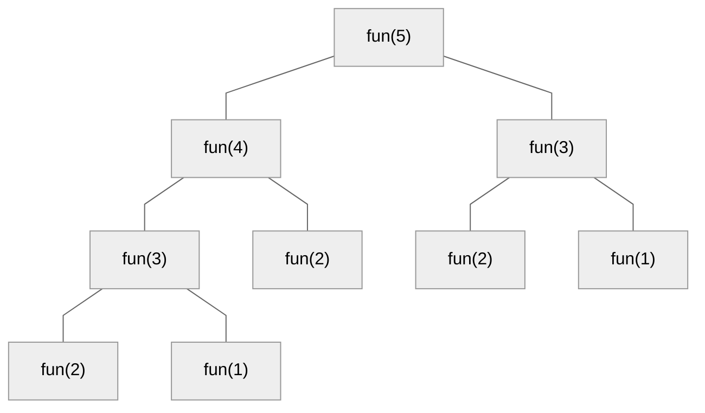

# Zadanie 4 - rozwiązanie

```mermaid
%%{init: {"flowchart": {"curve": "linear"}, "theme": "neutral"} }%%
flowchart TD
	R0["fun(5)"] --- R1["fun(4)"]
    R1 --- R2["fun(3)"]
    R2 --- R3["fun(2)"]
    R2 --- R4["fun(1)"]
    R1 --- R5["fun(2)"]
    R0 --- R6["fun(3)"]
    R6 --- R7["fun(2)"]
    R6 --- R8["fun(1)"]
```
