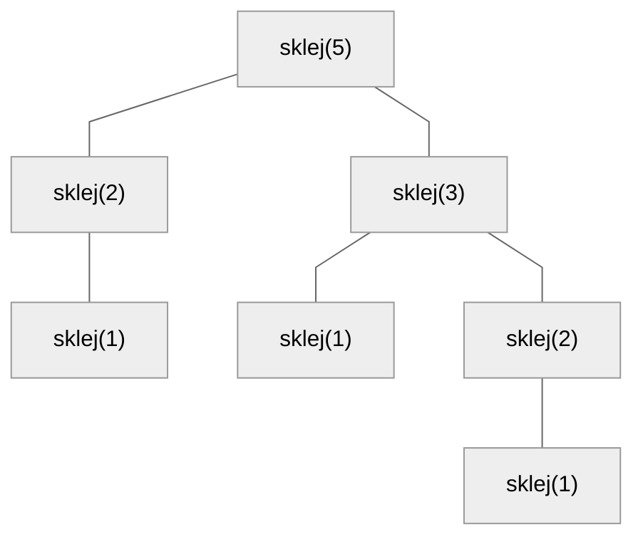

# Zadanie 1 - rozwiązanie

```mermaid
%%{init: {"flowchart": {"curve": "linear"}, "theme": "neutral"} }%%
flowchart TD
	R["sklej(5)"] --- R1["sklej(2)"]
    R --- R2["sklej(3)"]
    R1 --- R11["sklej(1)"]
    R2 --- R21["sklej(1)"]
    R2 --- R22["sklej(2)"]
    R22 --- R221["sklej(1)"]
```
