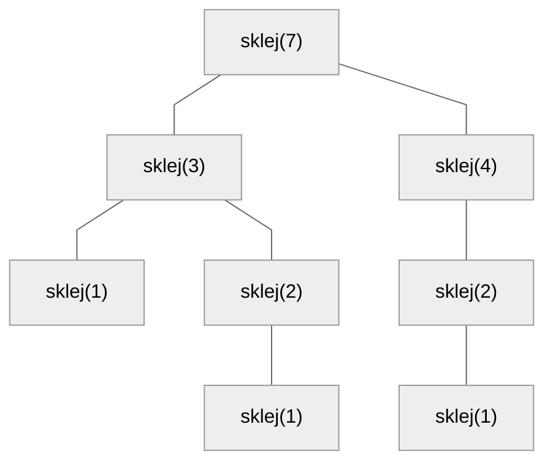

# Zadanie 2 - rozwiązanie

```mermaid
%%{init: {"flowchart": {"curve": "linear"}, "theme": "neutral"} }%%
flowchart TD
	R["sklej(7)"] --- R1["sklej(3)"]
    R --- R2["sklej(4)"]
    R1 --- R11["sklej(1)"]
    R1 --- R12["sklej(2)"]
    R12 --- R121["sklej(1)"]
    R2 --- R21["sklej(2)"]
    R21 --- R211["sklej(1)"]
```
