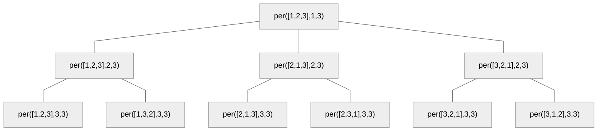

# Zadanie 1 - rozwiązanie

## Drzewo wywołań rekurencyjnych


```mermaid
%%{init: {"flowchart": {"curve": "linear"}, "theme": "neutral"} }%%
flowchart TD
	R["per([1,2,3],1,3)"] --- R1["per([1,2,3],2,3)"]
	R --- R2["per([2,1,3],2,3)"]
    R --- R3["per([3,2,1],2,3)"]
    R1 --- R11["per([1,2,3],3,3)"]
    R1 --- R12["per([1,3,2],3,3)"]
    R2 --- R21["per([2,1,3],3,3)"]
    R2 --- R22["per([2,3,1],3,3)"]
    R3 --- R31["per([3,2,1],3,3)"]
    R3 --- R32["per([3,1,2],3,3)"]
```

## Wynik

```
[1, 2, 3]
[1, 3, 2]
[2, 1, 3]
[2, 3, 1]
[3, 2, 1]
[3, 1, 2]
```
