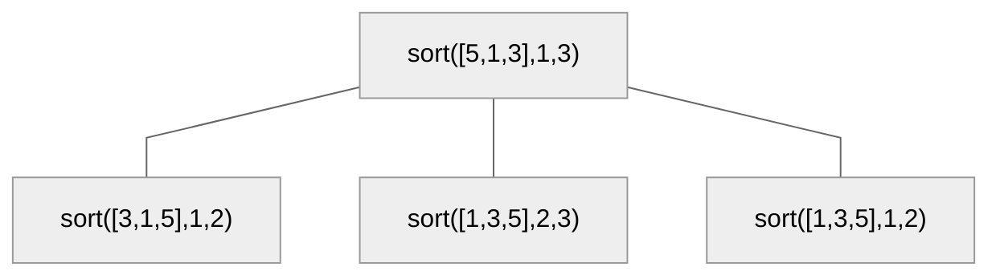

# Zadanie 1 - rozwiązanie

```mermaid
%%{init: {"flowchart": {"curve": "linear"}, "theme": "neutral"} }%%
flowchart TD
	R["sort([5,1,3],1,3)"] --- R1["sort([3,1,5],1,2)"]
	R --- R2["sort([1,3,5],2,3)"]
    R --- R3["sort([1,3,5],1,2)"]
```
