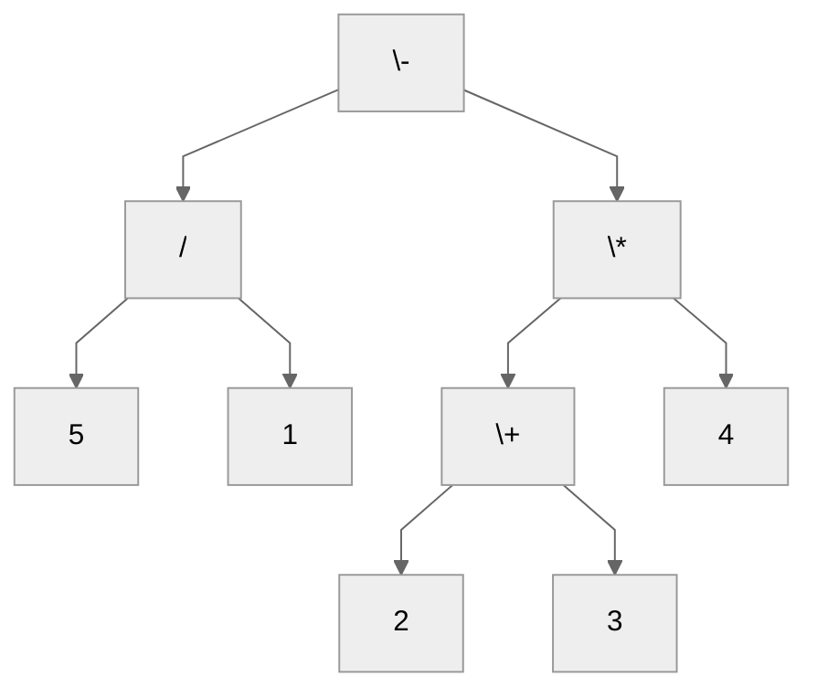
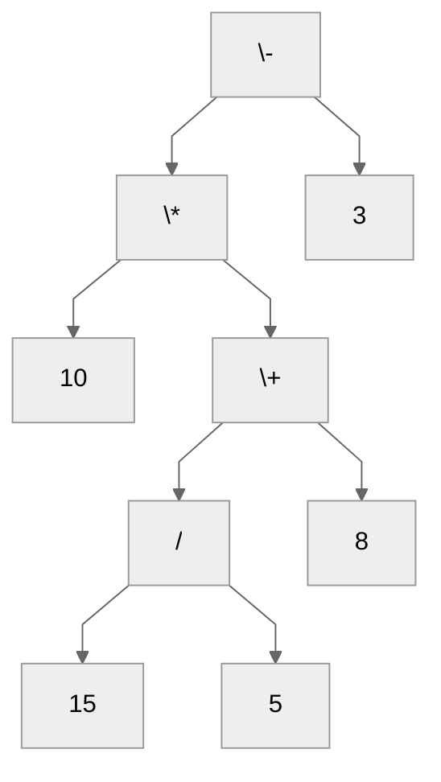

# Drzewa wyrażeń arytmetycznych

## Pseudokod

```
funkcja Oblicz(wierzchołek):
    1. Jeżeli wierzchołek jest liściem, to:
        2. Zwróć wartość wierzchołka
    3. Zwróć wynik operacji arytmetycznej, gdzie operatorem jest wartość wierzchołka, a wartościami są odpowiednio Oblicz(lewy potomek) oraz Oblicz(prawy potomek)
```

## Zadanie 1

Zapoznaj się z pseudokodem opisującym sposób obliczania wartości wyrażenia arytmetycznego zapisanego za pomocą drzewa binarnego, a następnie oblicz wartość wyrażenia reprezentowanego przez poniższe drzewo. Zapisz poszczególne kroki obliczeń poprzez przedstawienie zmieniającego się drzewa binarnego, gdzie, w odpowiedniej kolejności, poddrzewa są zastępowane poprzez jeden wierzchołek zawierający wartość wyrażenia arytmetycznego, które zostało obliczone na tym poddrzewie.



## Zadanie 2

Wykonaj polecenie z zadania pierwszego opierając się na poniższym drzewie.



## Zadanie 3

Przedstaw poniższe wyrażenie arytmetyczne w postaci drzewa wyrażeń arytmetycznych.

$4 + (9 - 3) * (6 / 2)$
