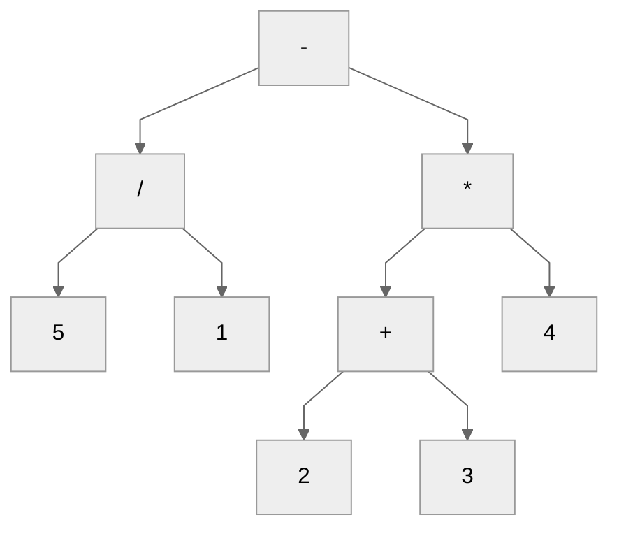
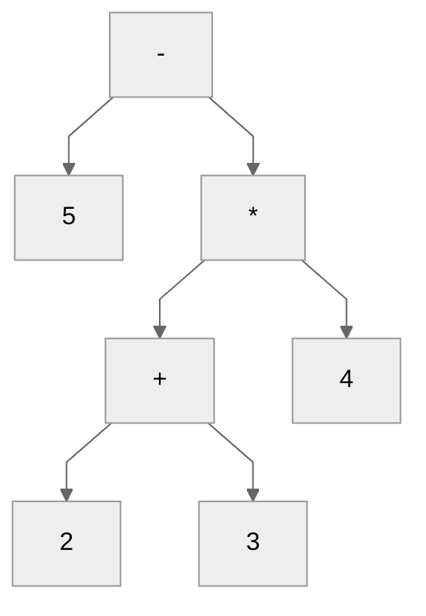
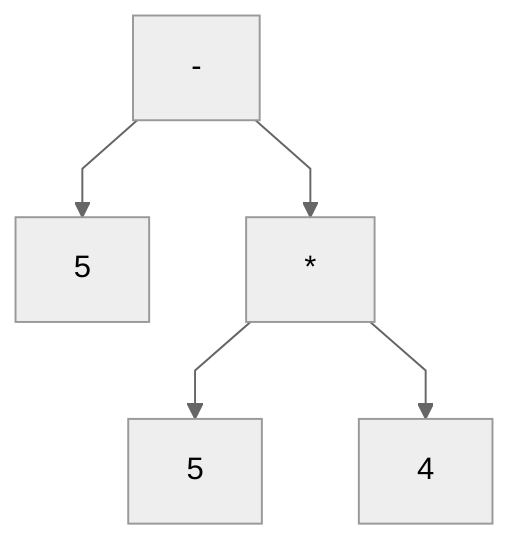
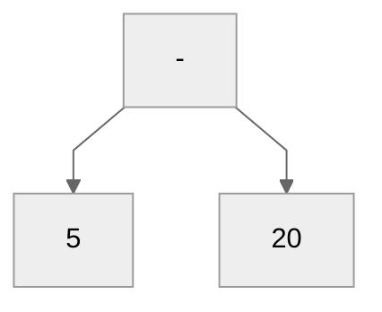
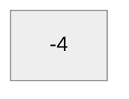

# Zadanie 1

## Drzewo 1

```mermaid
%%{init: {"flowchart": {"curve": "linear"}, "theme": "neutral"} }%%
flowchart TD
    op1["-"] --> op2["*"]
    op1 --> op3["/"]
    op3 --> n1["5"]
    op3 --> n2["1"]
    op2 --> op4["+"]
    op4 --> n3["2"]
    op4 --> n4["3"]
    op2 --> n5["4"]
```

## Drzewo 2

```mermaid
%%{init: {"flowchart": {"curve": "linear"}, "theme": "neutral"} }%%
flowchart TD
    op1 --> op3["5"]
    op1["-"] --> op2["*"]
    op2 --> op4["+"]
    op4 --> n3["2"]
    op4 --> n4["3"]
    op2 --> n5["4"]
```

## Drzewo 3

```mermaid
%%{init: {"flowchart": {"curve": "linear"}, "theme": "neutral"} }%%
flowchart TD
    op1 --> op3["5"]
    op1["-"] --> op2["*"]
    op2 --> op4["5"]
    op2 --> n5["4"]
```

## Drzewo 4

```mermaid
%%{init: {"flowchart": {"curve": "linear"}, "theme": "neutral"} }%%
flowchart TD
    op1 --> op3["5"]
    op1["-"] --> op2["20"]
```

## Drzewo 4

```mermaid
%%{init: {"flowchart": {"curve": "linear"}, "theme": "neutral"} }%%
flowchart TD
    op1["-4"]
```

## Wynik

$(5 / 1) - (2 + 3) * 4 =-15$