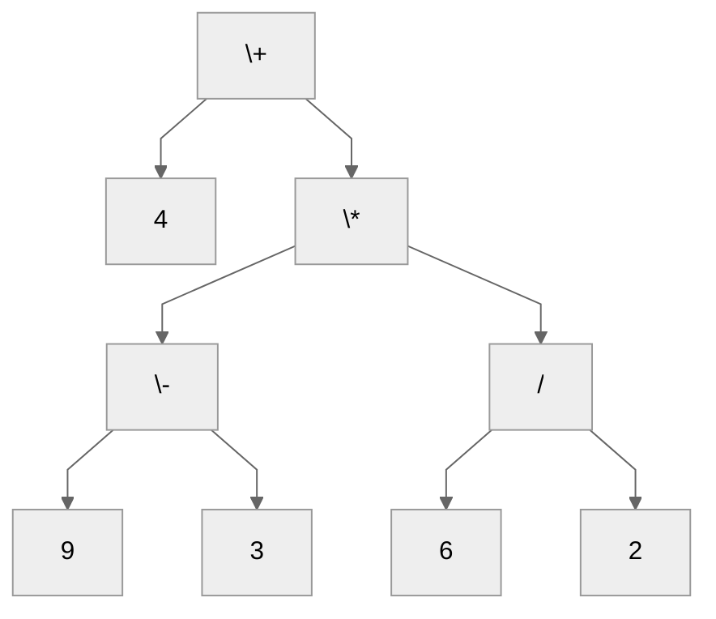

# Zadanie 1

## Drzewo

```mermaid
%%{init: {"flowchart": {"curve": "linear"}, "theme": "neutral"} }%%
flowchart TD
    op1["\+"] --> n1["4"]
    op1 --> op2["\*"]
    op2 --> op3["\-"]
    op3 --> n2["9"]
    op3 --> n4["3"]
    op2 --> op4["/"]
    op4 --> n5["6"]
    op4 --> n6["2"]
```
