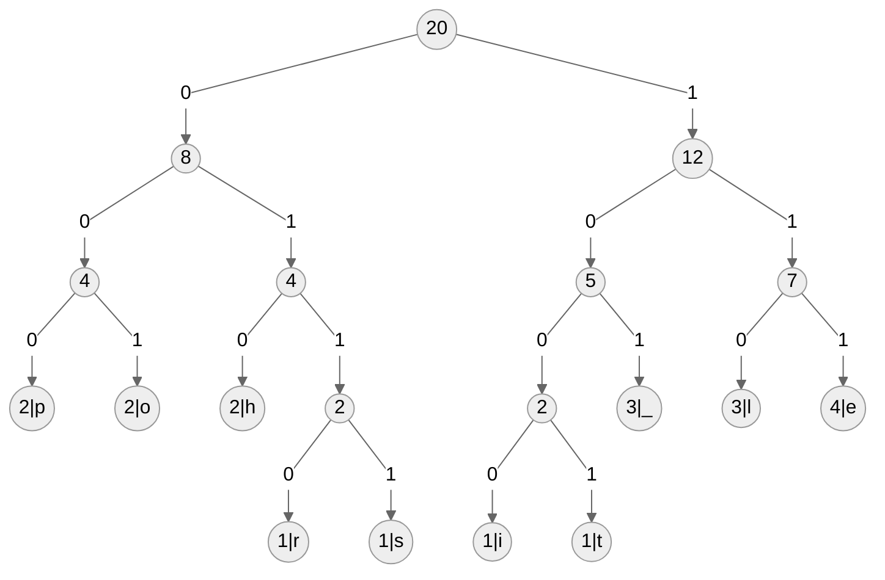

# Kody Huffmana

## Opis algorytmu

[huffman-coding.md](../../../../../algorithms/coding-and-compression/huffman-coding.md)

## Zadanie 1

Dany jest następujący tekst w języku angielskim, zapisany poniżej. Zgodnie z algorytmem kodowania Huffmana stwórz i rozrysuj drzewo kodów, a następnie zakoduj podany tekst za jego pomocą. Oblicz uzyskany stopień kompresji z dokładnością do dwóch miejsc po przecinku, zakładając, że oryginalny tekst był zakodowany za pomocą standardowego kodu ASCII, gdzie każdy znak to jeden bajt.

**Pamiętaj**: możliwe jest uzyskanie kilku różnych, **prawidłowych** drzew kodów.

> **knowledge_is_power**

## Zadanie 2

Poniżej podane jest drzewo kodów Huffmana, a następnie zakodowana wiadomość. Odkoduj wiadomość na podstawie drzewa, a także oblicz stopień kompresji z dokładnością do dwóch miejsc po przecinku, przyjmując jeden bajt na każdy znak w oryginalnym tekście.

### Drzewo kodów



### Wiadomość

```
0101111101101011000011110100110010101110110101000111001000110111
```