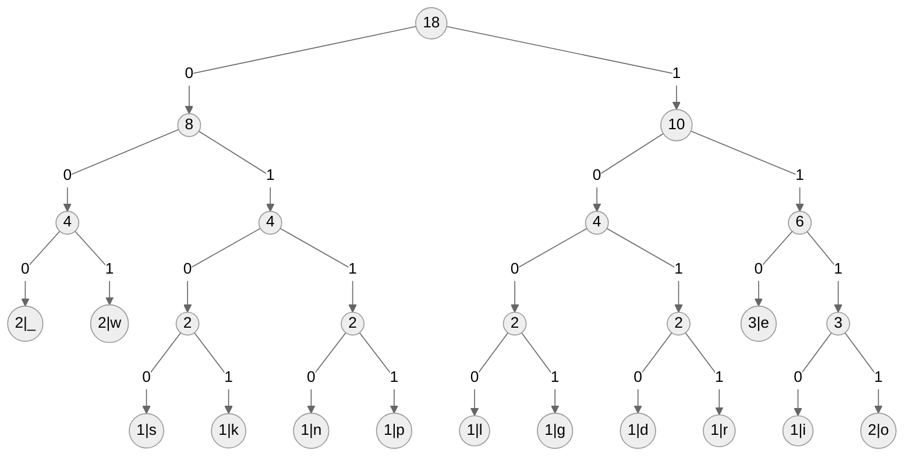

# Zadanie 1 - rozwiązanie

## Drzewo kodów



## Tabela kodów

|  znak  |     kod    |
| :-: | :------: |
| _ | 000 |
| d | 1010 |
| e | 110 |
| g | 1001 |
| i | 1110 |
| k | 0101 |
| l | 1000 |
| n | 0110 |
| o | 1111 |
| p | 0111 |
| r | 1011 |
| s | 0100 |
| w | 001 |

## Zakodowany tekst

```
01010110111100110001101010100111000011100100000011111110011101011
```

## Stopień kompresji

$45.14\%$
