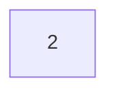
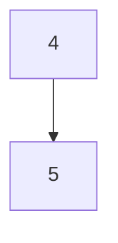
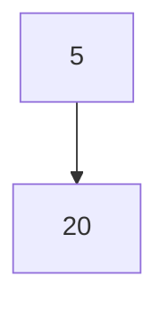
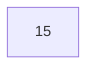
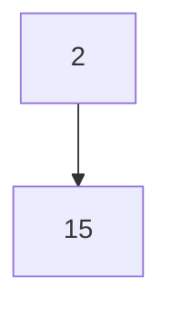
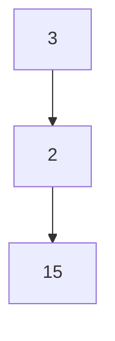
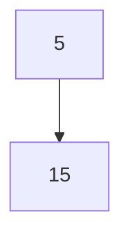
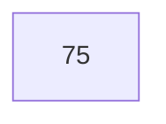
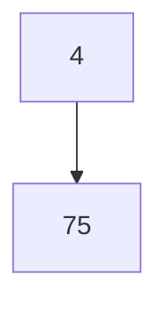
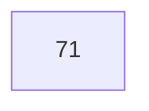

# Rozwiązanie 1

## Stos 1

```mermaid
 flowchart TD
    e1["2"]
```

## Stos 2

```mermaid
 flowchart TD
    e1["3"]
    e2["2"]
    e1 --> e2
```

## Stos 3

```mermaid
 flowchart TD
    e1["5"]
```

## Stos 4

```mermaid
 flowchart TD
    e1["4"]
    e2["5"]
    e1 --> e2
```

## Stos 5

```mermaid
 flowchart TD
    e1["20"]
```

## Stos 6

```mermaid
 flowchart TD
    e1["5"]
    e2["20"]
    e1 --> e2
```

## Stos 7

```mermaid
 flowchart TD
    e1["15"]
```

## Stos 8

```mermaid
 flowchart TD
    e1["2"]
    e2["15"]
    e1 --> e2
```

## Stos 9

```mermaid
 flowchart TD
    e1["3"]
    e2["2"]
    e3["15"]
    e1 --> e2
    e2 --> e3
```

## Stos 10

```mermaid
 flowchart TD
    e1["5"]
    e2["15"]
    e1 --> e2
```

## Stos 11

```mermaid
 flowchart TD
    e1["75"]
```

## Stos 12

```mermaid
 flowchart TD
    e1["4"]
    e2["75"]
    e1 --> e2
```

## Stos 13

```mermaid
 flowchart TD
    e1["71"]
```

## Wynik

$$71$$
