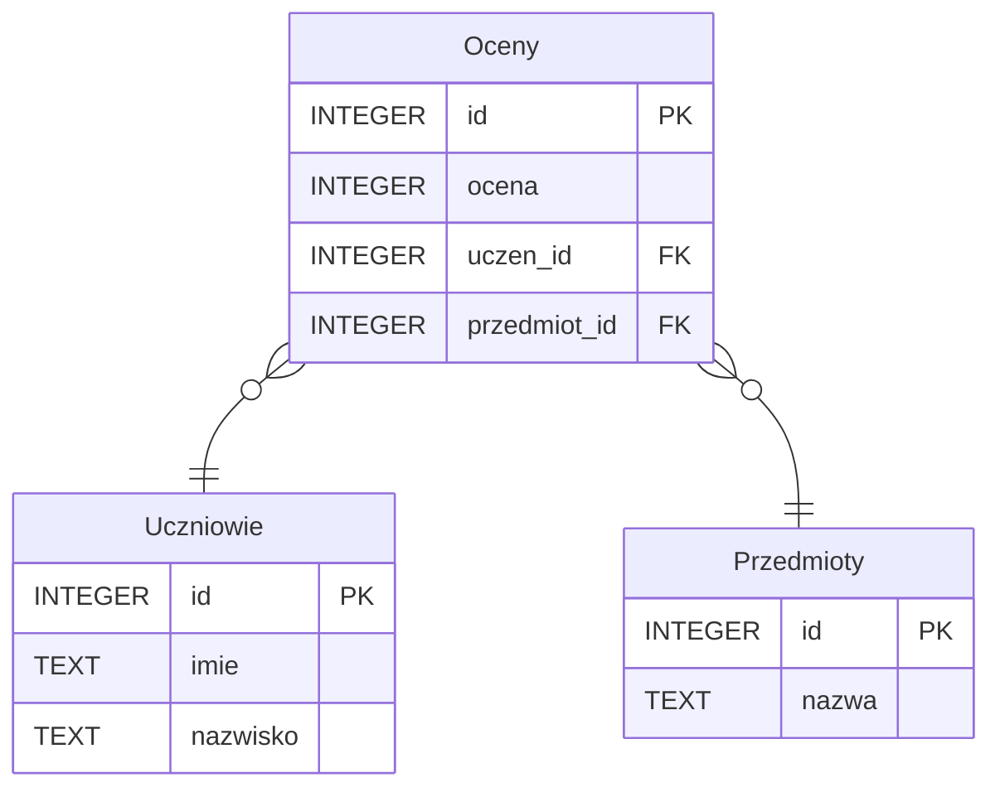

# Powtórzenie 1

## Zadanie 1

W pliku `long_bin.txt` zapisano jedną liczbę naturalną w systemie binarnym w postaci ciągu zer i jedynek. Ciąg składa się ze 1000 znaków.

[:material-note-text: long_bin.txt](../../../../assets/repeat-1/long_bin.txt)

W pliku `short_bin.txt` zapisano jedną liczbę naturalną w systemie binarnym w postaci ciągu zer i jedynek. Ciąg składa się ze 100 znaków.

[:material-note-text: short_bin.txt](../../../../assets/repeat-1/short_bin.txt)

Znajdź najdłuższy **spójny** podciąg składający się z takich samych znaków, np. samych zer albo samych jedynek. Podaj długość tego podciągu, znak z jakiego się składa oraz numer znaku początkowego i numer znaku końcowego w ciągu. Jeżeli jest kilka takich podciągów wypisz pierwszy z nich.

Odpowiedź dla pliku `short_bin.txt` to:

- długość: 7
- początek: 26
- koniec: 32
- znak: 0

## Zadanie 2

Dane są trzy tabele opisujące oceny uczniów z poszczególnych przedmiotów, tak jak przedstawiono poniżej.



Podaj komendę SQL, która wypisze imię, nazwisko, nazwę przedmiotu i średnią z tego przedmiotu, uwzględniając wyłącznie matematykę i informatykę, dla każdego ucznia, który z każdego z tych dwóch przedmiotów otrzymał średnią powyżej 5. Wyniki powinny być posortowane rosnąco po średniej.

## Zadanie 3

W pliku `visits.txt` znajduje się lista odwiedzin strony internetowej. Każda linia zawiera dane jednej sesji. Dane te zawierają datę i godzinę rozpoczęcia sesji, datę i godzinę zakończenia sesji, adres strony internetowej oraz adres IP użytkownika. Dane są oddzielone średnikiem. Pierwszy wiersz zawiera nagłówki kolumn.

[:material-note-text: visits.txt](../../../../assets/repeat-1/visits.txt)

Ze względu na błąd programu rejestrującego wyniki, niektóre wpisy są błędne. Można je rozpoznać po tym, że rozpoczęcie sesji jest późniejsze niż jej zakończenie.

Odpowiedz na poniższe pytania:

1. Ile jest błędnie zarejestrowanych wpisów?
2. Która strona była najczęściej odwiedzana (ignorując błędne wpisy)?
3. Która strona była sumarycznie najdłużej odwiedzana (ignorując błędne wpisy)?

## Zadanie 4

Jasiu wymyślił nową grę. Przed nim, na stole, ułożonych jest wiele kolorowych kart. Procedura, za którą podąża Jasiu wygląda następująco:

```
1. Dopóki są jeszcze karty na stole, wykonuj:
    2. Weź kolejną kartę do prawej ręki.
    3. Jeżeli lewa ręka jest pusta, to przełóż kartę z prawej ręki do lewej i idź do kroku 1.
    4. Jeżeli karty na lewej i prawej ręce są takie same, to przełóż kartę z prawej ręki do lewej i idź do kroku 1.
    5. Jeżeli karty na lewej i prawej ręce są różne, to odzuć po jednej karcie z prawej i lewej ręki.
```

Jasiu zastanawia się, dla danego układu kart na stole, ile kart będzie trzymał w lewej ręce i jakiego koloru po zakończeniu procedury. Dla ułatwienia Jasiu ponumerował kolory kart kolejnymi liczbami naturalnymi. Pomóż Jasiowi oblliczyć wynik dla danego układu kart.

|      **Karty**      | **Liczba kart na lewej ręce** | **Kolor karty na lewej ręce** |
|:-------------------:|:-----------------------------:|:-----------------------------:|
| 2, 5, 1, 1, 2, 1, 1 |               3               |               1               |
|      2, 2, 1, 1     |               0               |               -               |
| 2, 2, 3, 2, 4, 2, 3 |                               |                               |
| 3, 2, 3, 2, 3, 5, 5 |                               |                               |

Jasiu ma małe dłonie i zastanawia się, czy zdoła utrzymać wszystkie karty w lewej ręce, dlatego zwrócił się o pomoc do Ciebie. Zaprojektuj algorytm, który obliczy i wypisze ile **maksymalnie** kart Jasiu będzie musiał trzymać w lewej ręce dla danego układu kart. Algorytm powinien być zgodny z poniższą specyfikacją.

**Uwaga**: w swoim zapisie możesz korzystać jedynie z podstawowych operacji arytmetycznych (dodawanie, odejmowanie, mnożenie, dzielenie, reszta z dzielenia, dzielenie całkowite), instrukcji kontroli przepływu (instrukcja warunkowa, pętla warunkowa, pętla licząca), instrukcji dotyczących podstawowych operacji na zmiennych (utworzenie zmiennej, przypisanie wartości, odczytanie wartości), instrukcji dotyczących podstawowych operacji na tablicach (utworzenie tablicy o zadanym rozmiarze wypełnionej jedną wartością, odwołanie do elementu tablicy pod zadanym indeksem) oraz samodzielnie zdefiniowanych funkcji.

**Dane**:

- $n$ - liczba naturalna, liczba kart na stole, $n>0$
- $karty[1..n]$ - tablica liczb naturalnych, kolejne liczby to kolory kart na stole, tablica jest indeksowana od jedynki
  
**Wynik**:

- $maks\_kart$ - liczba naturalna, maksymalna liczba kart, które Jasiu będzie musiał trzymać w lewej ręce w dowolnym momencie wykonywania swojej gry.

## Zadanie 5

W pliku `u2.txt` znajduje się 100 liczb zapisanych w systemie U2, każda w osobnej linii.

[:material-note-text: u2.txt](../../../../assets/repeat-1/u2.txt)

W pliku `u2_test.txt` znajduje się 10 liczb zapisanych w systemie U2, każda w osobnej linii.

[:material-note-text: u2_test.txt](../../../../assets/repeat-1/u2_test.txt)

Podaj najmniejszą i największą liczbę z pliku `u2.txt`. Dla pliku `u2_test.txt` odpowiedź to:

- najmniejsza liczba: $100110000_{U2}$
- największa liczba: $000101101_{U2}$

## Zadanie 6

W pliku `characters.txt` znajdują się dane dotyczące pewnych postaci. Każda linia zawiera dane jednej postaci, tzn. jej identyfikator, nazwę, wzrost (w cm), wagę (w kg), oraz datę powstania. Dane są oddzielone średnikiem. Pierwszy wiersz zawiera nagłówki kolumn.

[:material-note-text: characters.txt](../../../../assets/repeat-1/characters.txt)

W pliku `equipment.txt` znajdują się dane dotyczące ekwipunku pewnych postaci. Każda linia zawiera dane jednego przedmiotu, tzn. jego identyfikator, nazwę oraz cenę (w złotówkach). Dane są oddzielone średnikiem. Pierwszy wiersz zawiera nagłówki kolumn.
    
[:material-note-text: equipment.txt](../../../../assets/repeat-1/equipment.txt)

W pliku `characters_equipment.txt` znajdują się dane o ekwipunku postaci. Każda linia zawiera dwie liczby: identyfikator postaci oraz identyfikator ekwipunku. Dane są oddzielone średnikiem. Pierwszy wiersz zawiera nagłówki kolumn.

[:material-note-text: characters_equipment.txt](../../../../assets/repeat-1/characters_equipment.txt)

Podaj ile jest takich postaci, które urodziły się w miesiącach od stycznia do czerwca włącznie, ich wzrost wynosi powyżej 180 cm lub waga poniżej 70 kg oraz nie posiadają ekwipunku droższego niż 1000 złotych.

Podaj identyfikator oraz nazwę pierwszej i ostatniej takiej postaci, po posortowaniu ich rosnąco po identyfikatorach.
