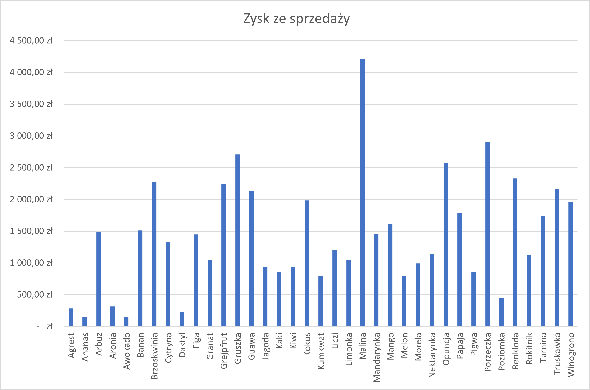
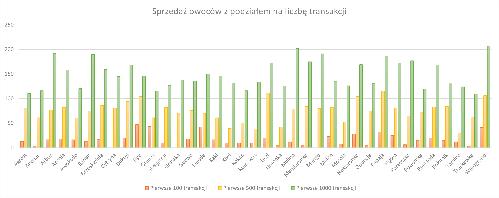

# Odpowiedzi

## Zadanie 1

|   **Owoc**  | **Liczba transakcji** |
|:-----------:|:---------------------:|
|    Agrest   |           22          |
|    Ananas   |           23          |
|    Arbuz    |           33          |
|    Aronia   |           32          |
|   Awokado   |           24          |
|    Banan    |           32          |
| Brzoskwinia |           31          |
|   Cytryna   |           25          |
|    Daktyl   |           30          |
|     Figa    |           28          |
|    Granat   |           22          |
|  Grejpfrut  |           23          |
|   Gruszka   |           27          |
|    Guawa    |           22          |
|    Jagoda   |           23          |
|     Kaki    |           27          |
|     Kiwi    |           21          |
|    Kokos    |           22          |
|   Kumkwat   |           22          |
|    Liczi    |           29          |
|   Limonka   |           22          |
|    Malina   |           35          |
|  Mandarynka |           34          |
|    Mango    |           32          |
|    Melon    |           28          |
|    Morela   |           24          |
|  Nektarynka |           34          |
|   Opuncja   |           28          |
|    Papaja   |           32          |
|    Pigwa    |           29          |
|  Porzeczka  |           30          |
|   Poziomka  |           24          |
|   Renkloda  |           29          |
|   Rokitnik  |           24          |
|   Tarnina   |           22          |
|  Truskawka  |           20          |
|  Winogrono  |           35          |

## Zadanie 2

|   **Owoc**  |      ** Zysk ze sprzedaży **     |
|:-----------:|:--------------------------------:|
|    Agrest   |                       283,80 zł  |
|    Ananas   |                       143,84 zł  |
|    Arbuz    |                     1 486,08 zł  |
|    Aronia   |                       317,58 zł  |
|   Awokado   |                       147,60 zł  |
|    Banan    |                     1 510,50 zł  |
| Brzoskwinia |                     2 272,11 zł  |
|   Cytryna   |                     1 326,75 zł  |
|    Daktyl   |                       230,16 zł  |
|     Figa    |                     1 449,78 zł  |
|    Granat   |                     1 041,90 zł  |
|  Grejpfrut  |                     2 240,28 zł  |
|   Gruszka   |                     2 706,18 zł  |
|    Guawa    |                     2 132,48 zł  |
|    Jagoda   |                       939,00 zł  |
|     Kaki    |                       858,48 zł  |
|     Kiwi    |                       939,84 zł  |
|    Kokos    |                     1 985,92 zł  |
|   Kumkwat   |                       795,96 zł  |
|    Liczi    |                     1 209,16 zł  |
|   Limonka   |                     1 048,75 zł  |
|    Malina   |                     4 209,68 zł  |
|  Mandarynka |                     1 452,50 zł  |
|    Mango    |                     1 617,77 zł  |
|    Melon    |                       801,90 zł  |
|    Morela   |                       990,36 zł  |
|  Nektarynka |                     1 139,06 zł  |
|   Opuncja   |                     2 571,53 zł  |
|    Papaja   |                     1 787,46 zł  |
|    Pigwa    |                       861,72 zł  |
|  Porzeczka  |                     2 899,26 zł  |
|   Poziomka  |                       451,01 zł  |
|   Renkloda  |                     2 330,16 zł  |
|   Rokitnik  |                     1 121,90 zł  |
|   Tarnina   |                     1 734,76 zł  |
|  Truskawka  |                     2 163,65 zł  |
|  Winogrono  |                     1 962,36 zł  |

## Zadanie 3

|   **Owoc**  | **Pierwsze 100 transakcji** | **Pierwsze 500 transakcji** | **Pierwsze 1000 transakcji** |
|:-----------:|:---------------------------:|:---------------------------:|:----------------------------:|
|    Agrest   |              13             |              81             |              110             |
|    Ananas   |              2              |              61             |              116             |
|    Arbuz    |              16             |              77             |              192             |
|    Aronia   |              18             |              82             |              158             |
|   Awokado   |              16             |              60             |              120             |
|    Banan    |              13             |              75             |              190             |
| Brzoskwinia |              17             |              86             |              159             |
|   Cytryna   |              0              |              81             |              145             |
|    Daktyl   |              20             |              94             |              168             |
|     Figa    |              47             |             104             |              146             |
|    Granat   |              43             |              61             |              115             |
|  Grejpfrut  |              10             |              82             |              127             |
|   Gruszka   |              0              |              70             |              138             |
|    Guawa    |              18             |              76             |              136             |
|    Jagoda   |              42             |              70             |              150             |
|     Kaki    |              16             |              61             |              146             |
|     Kiwi    |              9              |              39             |              132             |
|    Kokos    |              10             |              50             |              116             |
|   Kumkwat   |              10             |              38             |              134             |
|    Liczi    |              20             |             111             |              172             |
|   Limonka   |              4              |              42             |              125             |
|    Malina   |              12             |              79             |              202             |
|  Mandarynka |              4              |              84             |              175             |
|    Mango    |              0              |              80             |              191             |
|    Melon    |              23             |              82             |              135             |
|    Morela   |              7              |              52             |              126             |
|  Nektarynka |              28             |             104             |              169             |
|   Opuncja   |              4              |              75             |              131             |
|    Papaja   |              32             |             115             |              186             |
|    Pigwa    |              25             |              81             |              172             |
|  Porzeczka  |              6              |              64             |              177             |
|   Poziomka  |              15             |              72             |              119             |
|   Renkloda  |              20             |              83             |              168             |
|   Rokitnik  |              15             |              84             |              130             |
|   Tarnina   |              12             |              30             |              124             |
|  Truskawka  |              3              |              62             |              109             |
|  Winogrono  |              41             |             106             |              207             |

