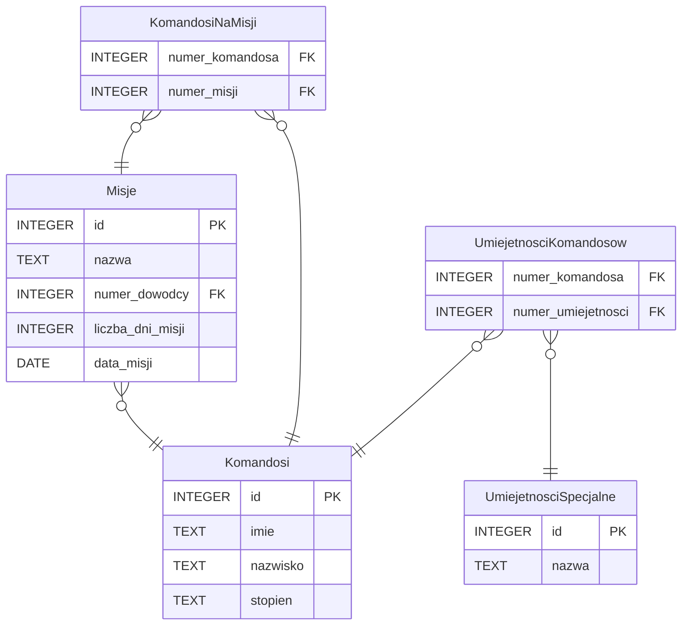

# Komandosi

Rozważmy następującą bazę danych:

Podaj instrukcje SQL realizujące poniższe zadania.

## Zadanie 1

Wypisz imię i nazwisko każdego porucznika.

## Zadanie 2

Policz, ile misji odbyło się w maju.

## Zadanie 3

Wypisz imię i nazwisko każdego komandosa, który był dowódcą na misji. Posortuj po nazwisku i imieniu.

## Zadanie 4

Dla każdego komandosa wypisz jego umiejętności specjalne.

## Zadanie 5

Dla każdej misji policz, ilu komandosów brało w niej udział.

## Zadanie 6

Dla każdego komandosa wypisz, ile łącznie spędził dni na misjach.

## Zadanie 7

Dla każdej misji wypisz, ilu saperów brało w niej udział.
