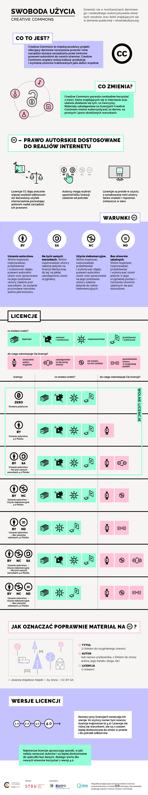

# Prawa autorskie

Prawa autorskie i właściwe posługiwanie się nimi oraz przestrzeganie ich jest bardzo ważne, szczególnie we współczesnym świecie, gdzie publiczne umieszczanie materiałów jest proste, powszechne i dostępne praktycznie dla każdego.

## Prezentacja

[:fontawesome-solid-file-pdf: Prezentacja](../assets/Prawa autorskie.pdf)

## Creative Commons

