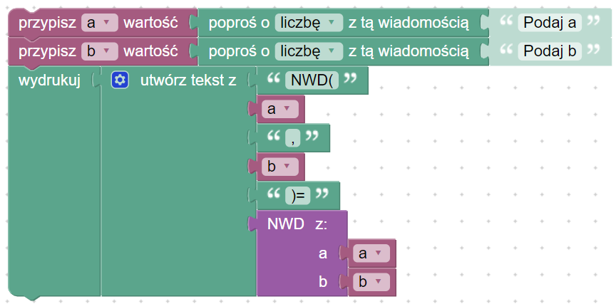
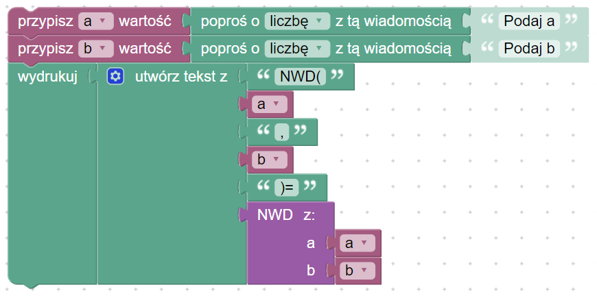

# NWD

## [:link: Opis problemu](../../../../algorithms/integers/gcd.md)

## NWD z odejmowaniem

### NWD

### Kod główny

### Link do implementacja

[NWD z odejmowaniem](https://blockly-demo.appspot.com/static/demos/code/index.html?lang=pl#gwzmpc)

## Algorytm Euklidesa (NWD z modulo) - wersja iteracyjna

### NWD

### Kod główny

### Link do implementacji

[Algorytm Euklidesa - wersja iteracyjna](https://blockly-demo.appspot.com/static/demos/code/index.html?lang=pl#owxed9)

## Algorytm Euklidesa (NWD z modulo) - wersja rekurencyjna

### NWD

### Kod główny

### Link do implementacji

[Algorytm Euklidesa - wersja rekurencyjna](https://blockly-demo.appspot.com/static/demos/code/index.html?lang=pl#8ujiet)
