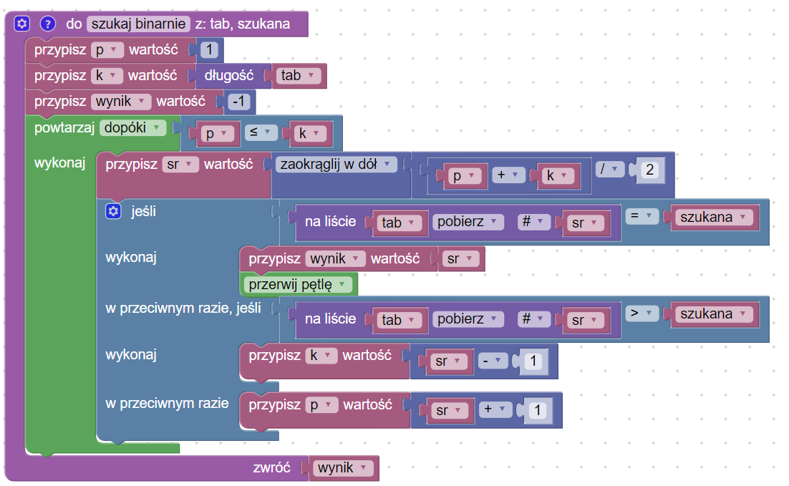
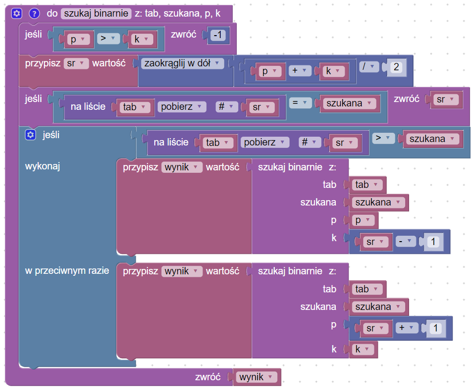
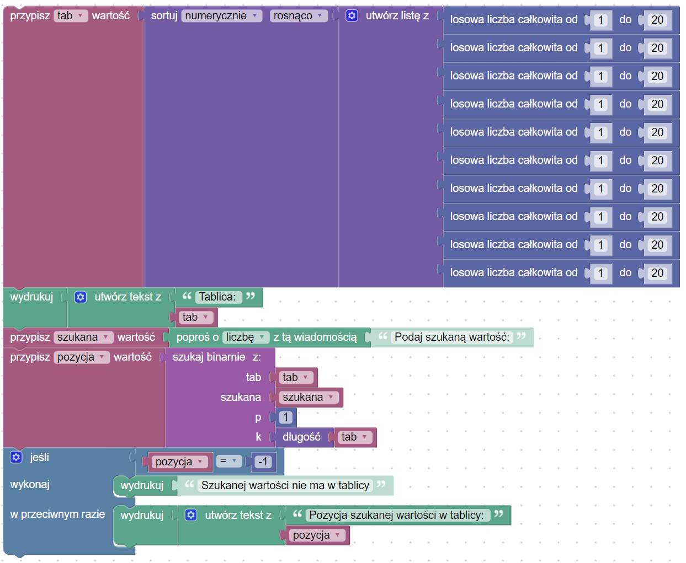

# Wyszukiwanie binarne

## [:link: Opis problemu](../../../../algorithms/searching/binary-search.md)

## Wersja iteracyjna

### Wyszukiwanie

### Kod główny

### Link do kodu

[Wyszukiwanie binarne - wersja iteracyjna](https://blockly-demo.appspot.com/static/demos/code/index.html?lang=pl#judq96)

## Wersja rekurencyjna

### Wyszukiwanie

### Kod główny

### Link do implementacji

[Wyszukiwanie binarne - wersja rekurencyjna](https://blockly-demo.appspot.com/static/demos/code/index.html?lang=pl#m3xt9c)
