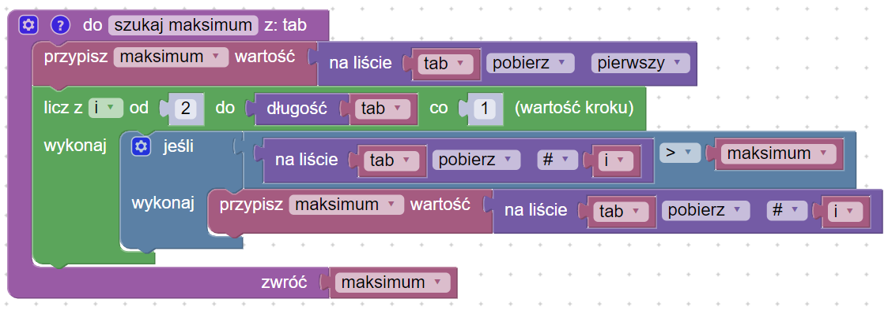

# Wyszukiwanie minimum i maksimum

## [Opis problemu](../../../../algorithms/searching/min-or-max.md)

## Implementacja

### Znajdowanie minimum

### Znajdowanie maksimum

### Kod główny

### Link do implementacji

[Znajdowanie minimum i maksimum](https://blockly-demo.appspot.com/static/demos/code/index.html?lang=pl#6rhsk3)
