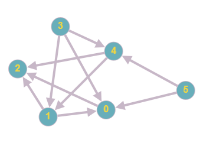

# Sortowanie topologiczne

## [Opis problemu](../../../../algorithms/graphs/topological-sort.md)


## Implementacja

```cpp linenums="1"
#include <iostream>
#include <vector>

using namespace std;

vector<int> topologicalSort(vector<vector<int> > &graph) {
    vector<int> inRanks = vector<int>(graph.size());
    vector<bool> removed = vector<bool>(graph.size());
    vector<int> result;
    bool change;
    
    for (int i = 0; i < graph.size(); i++) {
        for (int j = 0; j < graph[i].size(); j++) {
            inRanks[graph[i][j]]++;
        }
    }

    change = true;

    while (change && result.size() < graph.size()) {
        change = false;
        
        for (int i = 0; i < graph.size(); i++) {
            if (removed[i] || inRanks[i] > 0) {
                continue;
            }

            change = true;
            result.push_back(i);
            removed[i] = true;
            
            for (int j = 0; j < graph[i].size(); j++) {
                inRanks[graph[i][j]]--;
            }
        }
    }

    return result;
}

int main() {
	vector<vector<int> > graph = {
		{2},
		{0, 2},
		{},
		{1, 0, 4},
		{2, 1},
		{0, 4},
	};
    
    vector<int> result = topologicalSort(graph);
    
    if (result.size() < graph.size()) {
        cout << "Graph has a cycle" << endl;
    } else {
        for (int el : result) {
            cout << el << " ";
        }

        cout << endl;
    }

    return 0;
}
```


### Opis implementacji



[http://graphonline.ru/en/?graph=VzWmgsofErPDNlfp](http://graphonline.ru/en/?graph=VzWmgsofErPDNlfp)
